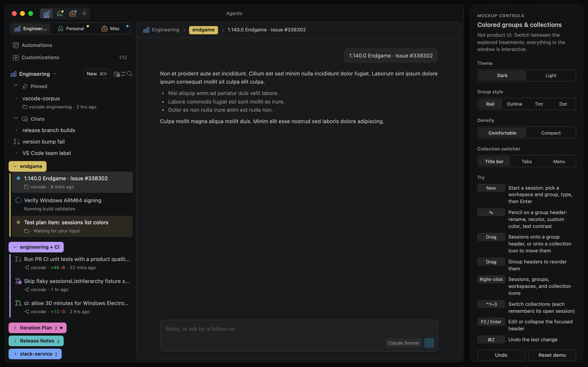
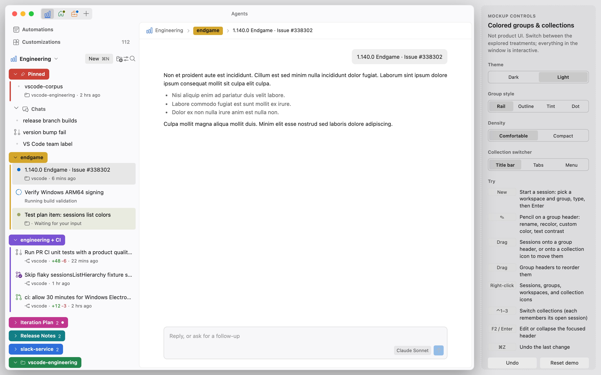
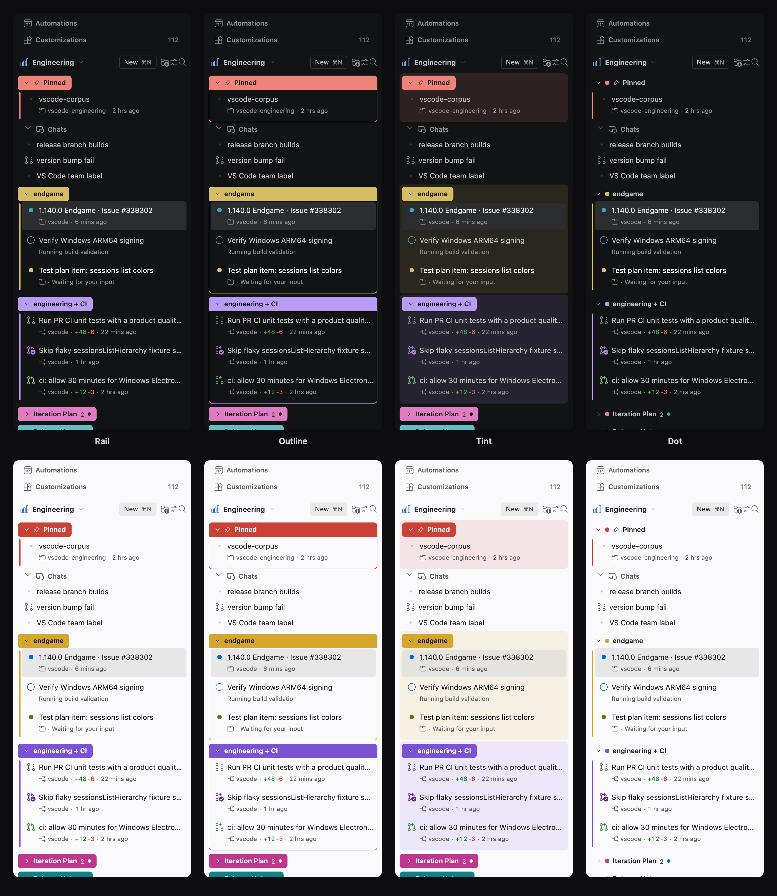
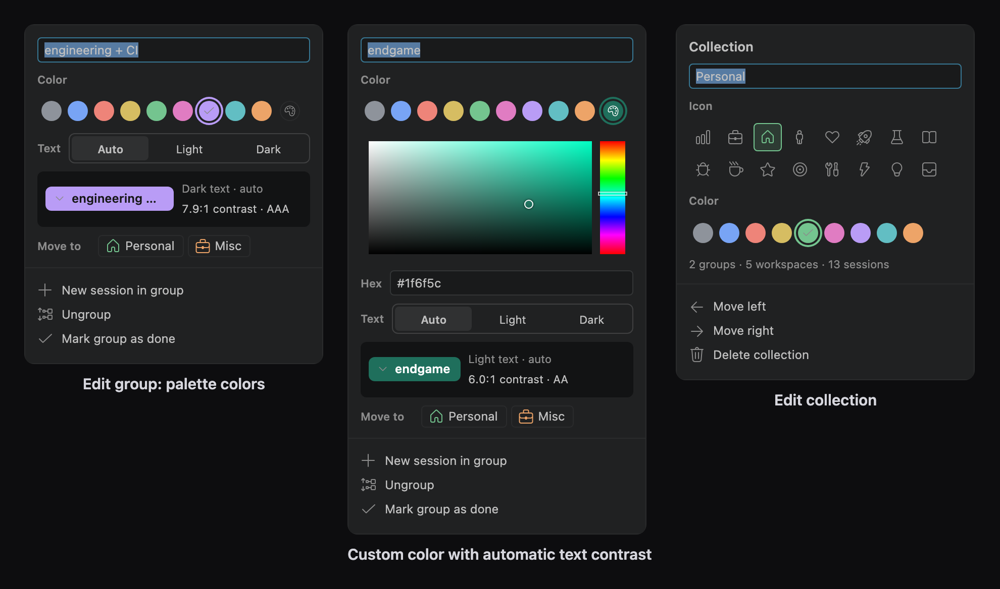

# Agents window: colored groups & collections (UX mockup)

An interactive UX mockup for the VS Code **Agents window**: sessions organized into **colored groups** (like browser tab groups) and **collections** (like browser workspaces).

> [!NOTE]
> This is a UX mockup for design exploration, not product code. The chat is lorem ipsum and the "agent" is a timer. It is built from real VS Code components, so it looks and behaves like the Agents window.

**▶ Open the demo:** https://yoyokrazy.github.io/agents-window-color-groups-mockup/

| Link | |
| --- | --- |
| [Dark](https://yoyokrazy.github.io/agents-window-color-groups-mockup/) | Interactive demo, 2026 Dark theme (default) |
| [Light](https://yoyokrazy.github.io/agents-window-color-groups-mockup/?theme=light) | Interactive demo, 2026 Light theme |
| [High contrast](https://yoyokrazy.github.io/agents-window-color-groups-mockup/?theme=hc) | Interactive demo, Dark High Contrast |
| [All states](https://yoyokrazy.github.io/agents-window-color-groups-mockup/___explorer.html?fixture=sessions/colorGroupsMockup) | Component Explorer with every fixture state (styles, editors, collections) in every theme |
| [Video (MP4)](https://yoyokrazy.github.io/agents-window-color-groups-mockup/walkthrough.mp4) | 70-second walkthrough with captions |




<details>
<summary>Light theme</summary>



</details>

## Try it

Everything inside the window is interactive. The **Mockup controls** panel on the right switches between the explored treatments.

- **Groups.** Click a group pill to collapse or expand it. Collapsed groups show a session count and the most urgent status.
- **Group styles.** Switch between **Rail** (default: browser-style pill with a colored rail), **Outline**, **Tint**, and **Dot**, plus **Comfortable** or **Compact** rows.
- **Edit a group.** Hover a group header and click the pencil (or press F2) to rename it, pick one of the palette colors, or pick a **custom color**. Text color switches between light and dark automatically for contrast, or can be forced.
- **Collections.** The Sessions header menu (the collection name above the list) always switches collections. The **Collection switcher** control adds browser-style icons in the title bar (default) or labeled tabs at the top of the sidebar, or leaves just the menu. Press Ctrl+1 to Ctrl+3 in any mode. Each collection remembers its open session. Right-click an icon or tab (or use the menu) to edit a collection; the editor opens right below it. Use **+** in the title bar or tabs, or **New Collection…** in the menu, to add one.
- **Drag and drop.** Drag sessions onto a group header to regroup them, or onto a collection icon to move them to another collection. Drag group headers to reorder them.
- **Context menus.** Right-click sessions, groups, workspaces, and collection icons to group, move, or mark things done.
- **New session.** Click **New** (or ⌘N / Ctrl+N), pick the workspace and group, type a task, and press Enter. The pretend agent "thinks" and replies; follow-ups append to the transcript.
- **Theme.** Switch between Dark and Light. The page reloads in the other theme and keeps the demo state.
- **Undo.** ⌘Z / Ctrl+Z, the **Undo** button in toasts, or **Reset demo** to start over.

### Group styles



### Editors



## How it's built

The mockup is a [Component Explorer](https://www.npmjs.com/package/@vscode/component-explorer) fixture in [microsoft/vscode](https://github.com/microsoft/vscode). It renders real VS Code UI: the workbench tree (`WorkbenchObjectTree`) with custom renderers and drag and drop, action bars, context menus, hovers, radios, buttons, input boxes, the editor's color picker widget, codicons, and the built-in 2026 Dark and Light color themes. Only the data model, the chat transcript, and the styling of groups and collections are mockup code.

The site in [`docs/`](docs) is a static, minified production build of only this fixture, served by GitHub Pages from `main` `/docs`. [`docs/build-info.json`](docs/build-info.json) records the microsoft/vscode commit it was built from.

| Path | |
| --- | --- |
| [`src/colorGroupsMockup/`](src/colorGroupsMockup) | Mockup source (the source of truth); lives at `src/vs/sessions/contrib/sessions/test/browser/colorGroupsMockup/` in a vscode checkout |
| [`scripts/build.sh`](scripts/build.sh) | Syncs the source into a vscode checkout and builds `docs/` |
| [`scripts/rspack.demo.config.mjs`](scripts/rspack.demo.config.mjs) | Narrows vscode's `build/rspack/rspack.serve-out.config.mts` to this one fixture, in production mode |
| [`scripts/stubs/`](scripts/stubs) | Build-time stand-ins for two fixture helpers that fetch from paths a Pages project site can't serve (TextMate grammars and `onig.wasm` for syntax highlighting, which the mockup doesn't use, and source-map lookups) |
| [`scripts/walkthrough.mjs`](scripts/walkthrough.mjs) | Playwright walkthrough that checks the demo end to end and records the video |
| [`scripts/screenshots.mjs`](scripts/screenshots.mjs) | Regenerates the images in `media/` |

## Rebuild

You need a microsoft/vscode checkout (ideally at the commit in `docs/build-info.json`) with dependencies installed:

```sh
cd /path/to/vscode
npm ci --ignore-scripts
(cd build/rspack && npm ci)
cp node_modules/@vscode/codicons/dist/codicon.ttf src/vs/base/browser/ui/codicons/codicon/codicon.ttf
```

Then, from this repo:

```sh
VSCODE_DIR=/path/to/vscode scripts/build.sh
```

`build.sh` copies `src/colorGroupsMockup/` into the vscode checkout's fixture folder (overwriting it), builds, and replaces `docs/`. To iterate with hot reload, run vscode's Component Explorer dev server (`npm run serve-out-rspack` or the **Component Explorer Server** task) and open `http://localhost:5123/___explorer?mode=embedded&fixture=sessions/colorGroupsMockup/Interactive/Dark`; copy your changes back into `src/colorGroupsMockup/` before building.

To check a build, serve it under the same sub-path as GitHub Pages and run the walkthrough:

```sh
mkdir -p /tmp/site && ln -sfn "$PWD/docs" /tmp/site/agents-window-color-groups-mockup
(cd /tmp/site && python3 -m http.server 8765) &
node scripts/walkthrough.mjs /tmp/walk --base http://127.0.0.1:8765/agents-window-color-groups-mockup/
node scripts/walkthrough.mjs /tmp/walk-light --theme Light2026 --base http://127.0.0.1:8765/agents-window-color-groups-mockup/
```

It fails on any failed check, console error, or failed request. To refresh the media:

```sh
node scripts/screenshots.mjs
node scripts/walkthrough.mjs /tmp/video --video --base http://127.0.0.1:8765/agents-window-color-groups-mockup/
ffmpeg -i /tmp/video/*.webm -c:v libx264 -preset slow -crf 26 -pix_fmt yuv420p -movflags +faststart -an media/walkthrough.mp4
ffmpeg -i /tmp/video/*.webm -vf "setpts=PTS/1.5,fps=8,scale=880:-1:flags=lanczos,split[s0][s1];[s0]palettegen=max_colors=96:stats_mode=diff[p];[s1][p]paletteuse=dither=bayer:bayer_scale=5:diff_mode=rectangle" media/walkthrough.gif
scripts/build.sh   # copies og.png and walkthrough.mp4 into docs/
```

## License

MIT, see [LICENSE](LICENSE). Built from [microsoft/vscode](https://github.com/microsoft/vscode); see [NOTICE.md](NOTICE.md) for third-party notices.
